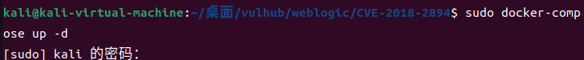
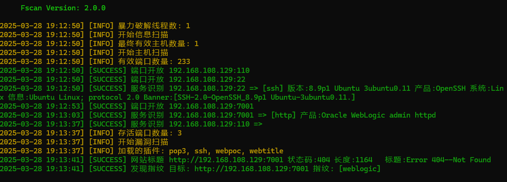
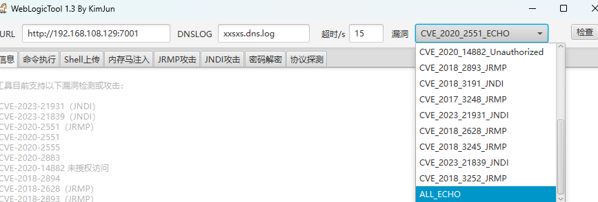
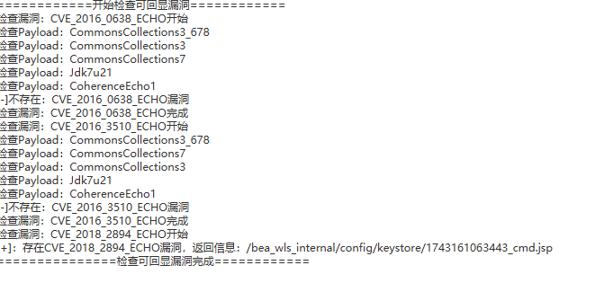
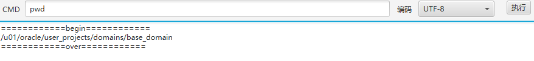

# CVE-2018-2894

# Oracle WebLogic Server WLS Core Components 反序列化漏洞


受影响的 WebLogic 版本​：

WebLogic Server 10.3.6.0

WebLogic Server 12.1.3.0

WebLogic Server 12.2.1.2

WebLogic Server 12.2.1.3


启动docker环境


用fscan扫描靶机192.168.108.129
```
fscan.exe -h 192.168.108.129
```
扫描结果

可以看到开放了7001端口,weblogic框架
利用工具weblogictools探测是否有漏洞


发现漏洞:


选择CVE_2018_2894_ECHO漏洞模块

成功执行


