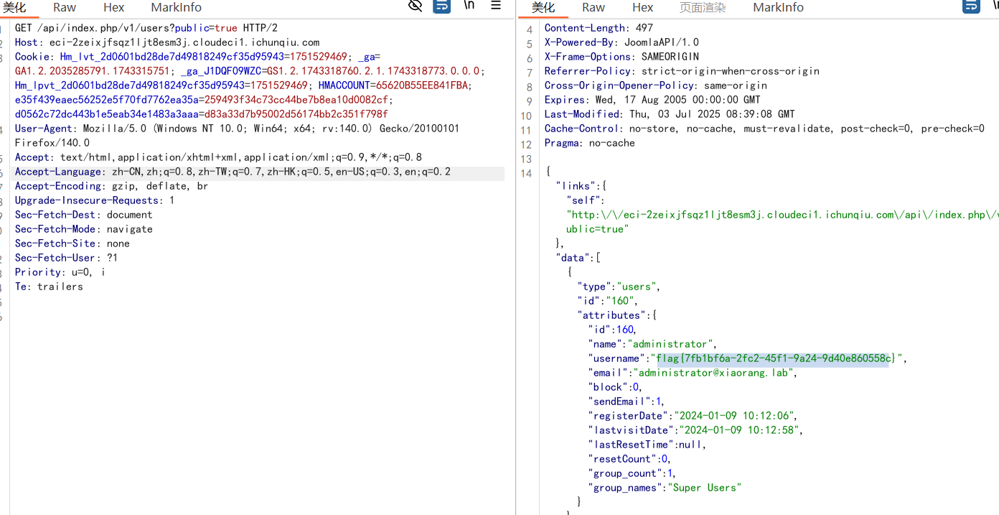

# CVE-2023-23752
Joomla 在海外使用较多，是一套使用 PHP 和 MySQL 开发的开源、跨平台的内容管理系统(CMS)。%0D%0A%0D%0AJoomla 4.0.0 至 4.2.7 版本中的 ApiRouter.php#parseApiRoute 在处理用户的 Get 请求时未对请求参数有效过滤，导致攻击者可向 Joomla 服务端点发送包含 public=true 参数的请求(如：/api/index.php/v1/config/application?public=true&key=value) 进行未授权访问

