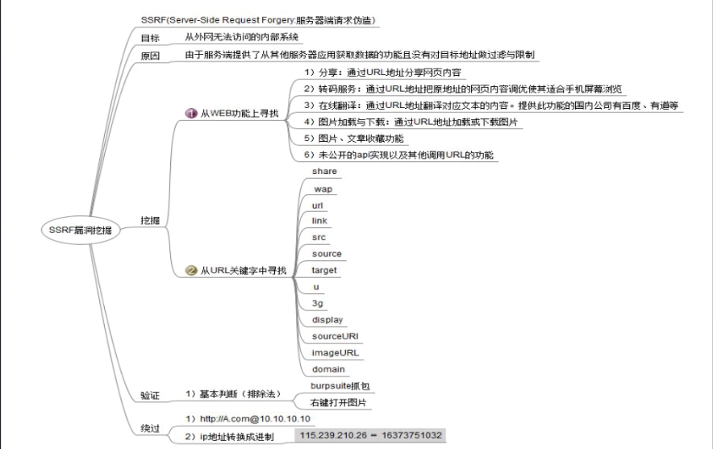

# SSRF
SRF漏洞点挖掘
1. 社交分享功能：获取超链接的标题等内容进行显示

2. 转码服务：通过URL地址把原地址的网页内容调优使其适合手机屏幕浏览

3. 在线翻译：给网址翻译对应网页的内容

4. 图片加载/下载：例如富文本编辑器中的点击下载图片到本地；通过URL地址加载或下载图片

5. 图片/文章收藏功能：主要其会取URL地址中title以及文本的内容作为显示以求一个好的用具体验

6. 云服务厂商：它会远程执行一些命令来判断网站是否存活等，所以如果可以捕获相应的信息，就可以进行ssrf测试

7. 网站采集，网站抓取的地方：一些网站会针对你输入的url进行一些信息采集工作

8. 数据库内置功能：数据库的比如mongodb的copyDatabase函数

9. 邮件系统：比如接收邮件服务器地址

10. 编码处理, 属性信息处理，文件处理：比如ffpmg，ImageMagick，docx，pdf，xml处理器等

11. 未公开的api实现以及其他扩展调用URL的功能：可以利用google 语法加上这些关键字去寻找SSRF漏洞

12.从远程服务器请求资源（upload from url 如discuz！；import & expost rss feed 如web blog；使用了xml引擎对象的地方 如wordpress xmlrpc.php）

 

URL关键字：

Share、wap、url、link、src、source、target、u、3g、display、sourceURL、imageURL、domain

摘自[13907150.html](https://www.cnblogs.com/miruier/p/13907150.html)