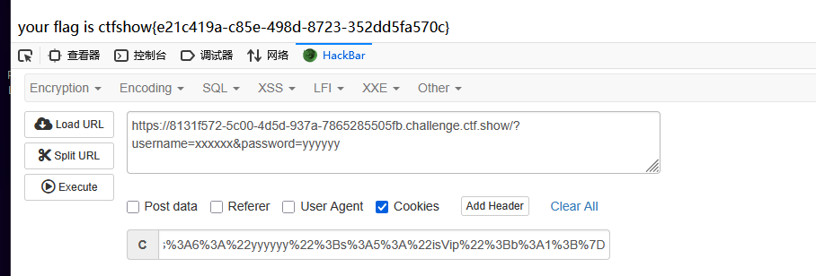

# web256
```
<?php
class ctfShowUser
{
    public $username = 'xxxxxx';
    public $password = 'yyyyyy';
    public $isVip = true;
}
$a=new ctfShowUser();
$b=serialize($a);
echo urlencode($b);
```
阅读代码,发现与上题不同处在于需满足
```
if($this->username!==$this->password)
```
为真
设置不一样即可
