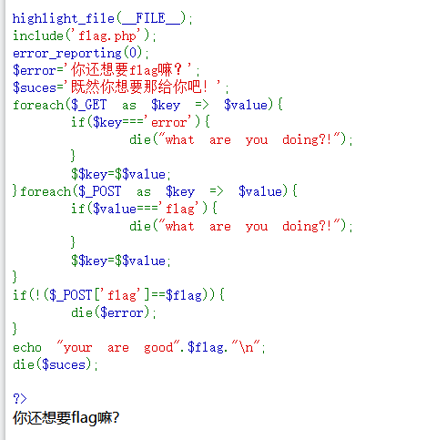
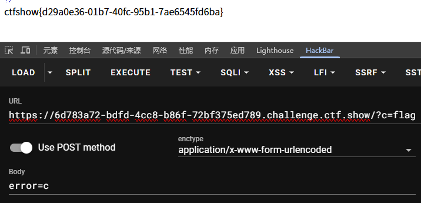

# web

考点:变量覆盖,die函数

die函数终止时会将变量输出,本题用此特性将flag输出,而不是按题目逻辑输出flag

分析,传入的flag参数需要与$flag相等才能输出flag,且参数有覆盖

```
foreach($_GET as $key => $value){  // ① 循环遍历所有URL参数
    if($key === 'error'){          // ② 检查参数名是否为'error'
        die("what are you doing?!"); // ③ 若匹配则立即终止程序
    }
}
```
$flag参数肯定在flag.php文件里
第一次变量覆盖将$flag提取出来赋给 $c
第二次将$c变量赋值给 $error变量
最终执行die函数输出$error变量


