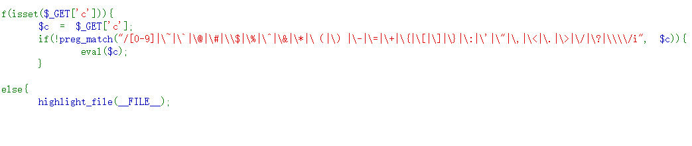
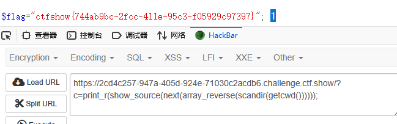

# web40

这里过滤的是中文括号(太阴了)
看别人的题解:
查看当前工作目录getcwd()，扫描当前目录及文件"scandir()"输出 为数组，flag.php 在倒数第二个个位置那就数组倒置array_revers()，变为正数第二，在使用next()函数指向从第一个指向第二个（及指向flag.php）,最后使用show_source（）查看文件的内容 
```
?c=print_r(show_source(next(array_reverse(scandir(getcwd())))));  
```
