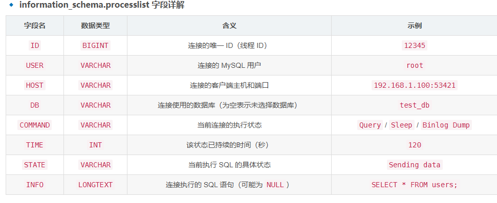

# babyweb
题示:内网访问

改XFF头,没有变化
扫描目录,访问conn.php什么都没有
御剑扫完都没扫出来,看了下有个ssrf.php

直接file://flag

官方题解有一点就是用到了mysql中的information_schema.processlist表,第一次见

information_schema.processlist 表（或 SHOW PROCESSLIST; 命令）用于查看 MySQL 当前所有的连接进程，帮助管理员监控数据库活动并排查性能问题。以下是该表的字段及其具体含义：

详见[145873450](https://blog.csdn.net/TangKenny/article/details/145873450)