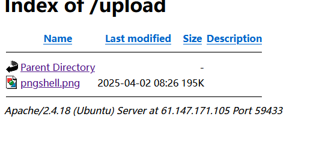
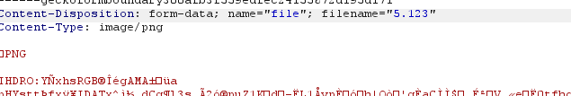
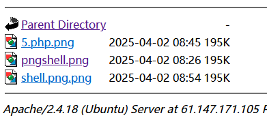
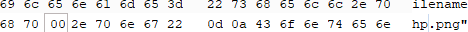
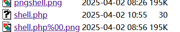
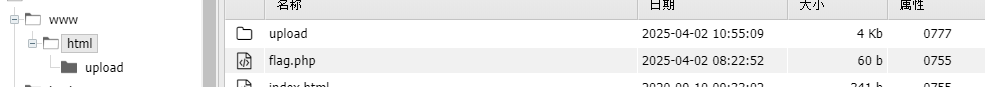

# wzsc_文件上传
文件上传点,不多说直接先上传图片马,上传后没有任何提示也没有路径,dirsearch扫一下或者手动猜,结果在upload下能够看见目录,和上传的文件

留意apache服务,可能要利用到文件配置.htaccess
先来修改一下文件后缀为php发现没有上传成功,
随便修改后缀,判断黑白名单.123


没有成功,那么应该是白名单,尝试一下.htacess,还是不行
测试一下检测的逻辑:

发现上传成功,推测为取.后的字符进行判断

尝试一下0x00截断,

还是不行
::$DATA还是不行
放弃了看一下大佬的,原来要用条件竞争,文件其实上传成功了,但是被删除了(只顾着看前端返回了)
```
<?php fputs(fopen("shell.php", "w"), '<?php @eval($_POST["cmd"]); ?>'); ?>
```
在BP里Intruder上传后不断访问/upload/上传文件名,就能写入代码了
注意上传包线程数设置小于访问包(踩坑:访问的线程高一点,不然很可能无法创建)

成功创建,之后用蚁剑连接,
