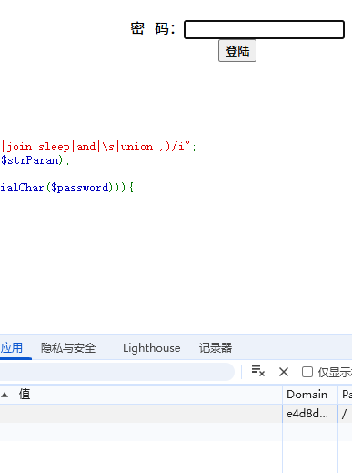
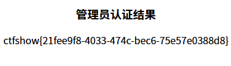

# web11
```
<?php
        function replaceSpecialChar($strParam){
             $regex = "/(select|from|where|join|sleep|and|\s|union|,)/i";
             return preg_replace($regex,"",$strParam);
        }
        if(strlen($password)!=strlen(replaceSpecialChar($password))){
            die("sql inject error");
        }
        if($password==$_SESSION['password']){
            echo $flag;
        }else{
            echo "error";
        }
    ?>
```

题目逻辑:从session获取的password与传入的password比较,password进行了正则过滤,过滤前后需保持一致

php是依据，一个名为PHPSESSID的cookie，根据它的值，确定要调用哪个session文件的。去浏览器中，可以看到一个cookie名为PHPSESSID，假如它的值为"sess_adbjsf2q1ass26oootd163sf84"，那么，当访问服务器的时候，就会调用session目录下名为"sess_sess_adbjsf2q1ass26oootd163sf84"的文件

这里直接将其置为空,密码也为空(用谷歌)


